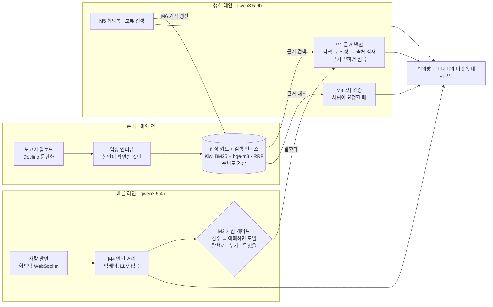

# MINIME 기획서 v3

> 회의를 이끌어 줄 리더도, 정해진 진행 방식도 없는 학생·사회초년생 팀을 위한 **AI 회의 보조자**
> 1. 몇 명이 빠져서 원래는 열 수 없던 회의를, 불참자의 미니미가 대신 참석해서 **진행할 수 있게** 한다.
> 2. 내가 참석하더라도, 내 미니미와 함께 내 의견과 결론을 **2차로 검증**할 수 있다.

- 저장소: `zonxwon/mymini-backend` (작업 브랜치: `itsdongjunday`)
- 단계: 해커톤 MVP
- 문서 상태: v1(초안) → v2(AI 설계 보강) → **v3(모델 선정·무료·훈련 없음 조건 반영)**. v1 대비 바뀐 점은 마지막 장에 있다.
- 작성 조건: **전부 무료**(로컬 오픈 모델·오픈소스) · **해커톤 시간 안에 구현** · **훈련 없이** · **성능과 완성도가 최우선**(억지로 AI를 붙이지 않는다)

---

## 0. 한눈에 보기

기획(문제·원칙·안전장치)은 v1을 그대로 살린다. 바꾼 것은 **"어떻게 만드나(AI 설계)"와 "얼마나 잘 되나(평가)"** 두 가지다.
v1은 외부 API에 프롬프트를 보내고 결과를 받는 구조라 심사위원이 보기에 **우리가 만든 AI가 없었다.**
v3는 미니미를 **우리가 직접 설계한 AI 모듈 6개**로 다시 짜고, 각 모듈은 **더 단순한 방법과 비교해 숫자로 이길 때만** 쓴다.

| 바꾸는 것 | v1 | v3 |
| --- | --- | --- |
| 모델 | OpenAI `gpt-4o-mini` (유료) | 로컬 오픈 모델 2개: `qwen3.5:4b`(판단) + `qwen3.5:9b`(작성·검증), Gemma 4와 비교해 확정. 비용 0원 |
| 미니미의 근거 | 말투 + 최근 발언 20개 | 보고서 + **입장 인터뷰** → **입장 카드** + 하이브리드 검색 + 문장마다 출처 |
| 언제 말하나 | LLM 관련도 점수 × 미니미 수 × 최대 4라운드 | **점수 계산 → 애매할 때만 작은 모델 1번** (개입 게이트) |
| 2차 검증 | 없음 | 주장 분해 → 근거 대조 → 모순 검사 → 검증 카드 |
| 근거가 없을 때 | "확인 필요" 문구 | 검색 점수로 **말하지 않기**를 결정 + 복귀자 확인 질문으로 저장 |
| 결정 | 회의록에 결론 | 불참자 관련 결정은 **보류 결정** → 복귀자가 승인·이의 |
| 증명 | 없음 | 평가 세트 + 지표 6개 + 기준선 비교표 |

---

## 1. 한 줄 정의와 평가 기준 대응

**MINIME는 팀원의 보고서와 짧은 입장 인터뷰로 만든 '근거 있는 분신'이, 빠진 사람 대신 회의에 들어가고, 참석한 사람의 주장을 한 번 더 검증하는 팀플 회의 AI다.**

- **트랙**: 더 나은 캠퍼스를 위한 AI. 팀플 회의는 대학생 대부분이 매 학기 겪는 문제다.
- **발표 한 문장**: "빠진 사람의 미니미는 본인이 확인한 입장과 보고서에 있는 말만 하고, 없으면 입을 다문다."

| 평가 지표 | 배점 | 우리가 보여줄 것 |
| --- | --- | --- |
| 주제 부합성 및 타당성 | 30 | 캠퍼스 팀플 회의라는 구체적 문제, '인원 부족으로 회의 불가'를 해결하는 개발 의도, 기대효과를 숫자로 제시(미뤄진 회의 수, 결정까지 걸린 시간) |
| 창의성 및 현장적용성 | 30 | '불참자의 근거 있는 분신'과 '보류 결정'은 기존 회의록 도구에 없는 개념. 실제 수업 팀플 시나리오로 바로 쓰는 웹 앱 |
| 기술성 및 완성도 | 40 | 모듈마다 논문에 기댄 설계와 그 이유, 평가 세트로 잰 성능, 모델이 죽어도 멈추지 않는 시연 |

**원칙: 단순한 방법이 기준선이다.** AI 모듈은 같은 평가 세트에서 더 단순한 방법(규칙, 프롬프트만)보다 나을 때만 쓴다. 못 이기면 단순한 쪽을 쓰고, 그 비교 결과도 발표에 넣는다. 이 비교 자체가 '적용 기술의 타당성' 점수다.

---

## 2. 문제 정의 (v1 유지)

| Pain point | 설명 |
|---|---|
| 리더·프로세스 부재 | 누가 진행하고, 어떤 순서로 논의하고, 어떻게 결론을 내는지 정해져 있지 않다. |
| 일정 관리 | 일정 조율이 깔끔하지 않아 팀원이 모두 모이기 어렵다. |
| 인원 부족으로 회의 불가 | 일부가 빠지면 원래는 회의를 할 수 없거나, 불참자 의견이 빠진 채 결정된다. |
| 검증 부족 | 리더나 경험자가 없어서 참석자의 의견과 결론을 한 번 더 점검해 줄 사람이 없다. |
| 흐름 이탈 | 핵심 대화에서 벗어나 다른 이야기로 흐르면서 비효율적인 회의가 되기 쉽다. |

일정 관리는 문제로 인식하지만 **이번 MVP 범위에는 넣지 않는다.**

**대상**: 팀 프로젝트를 하는 학생, 첫 직장에서 팀 회의를 하는 사회초년생

- **시나리오 A (대리 참석)**: '스피치와 토론' 4인 팀. 회의 당일 2명만 참석한다. 불참자 2명이 미니미를 ON으로 켜 두면, 안건이 논의될 때 미니미가 보고서·입장 카드를 근거로 "저는 ~라고 생각해요 [보고서 2문단]"이라고 말한다. 끝나면 의견·충돌·결론·**보류 결정**이 정리되고, 돌아온 사람은 승인하거나 이의를 단다.
- **시나리오 B (2차 검증)**: 참석자가 결론을 내면 그 사람의 미니미가 근거가 충분한지, 이전 발언과 앞뒤가 맞는지, 놓친 점은 없는지 카드로 보여 준다. 고칠지 말지는 사람이 정한다.

---

## 3. 솔루션 원칙 (v1 유지 + 보강)

- AI는 대화의 주체가 아니라, 적절히 개입하는 보조자다. 사람이 회의의 주인이다.
- 개입은 필요할 때만 한다. 빈번한 개입은 회의를 방해한다.
- 불참자의 의견을 대신 전할 때는 **근거가 있는 내용만** 말한다. **근거가 약하면 말하지 않는다.**
- 최종 결정은 사람이 한다. 불참자 입장에 영향을 주는 결정은 **보류**한다.
- **(v3 추가)** 미니미가 말하는 모든 입장은 **본인이 확인한 것**이어야 한다. AI가 확장한 문장은 후보일 뿐이다.

---

## 4. 미니미를 만드는 방법: 다섯 가지 비교

결론: **보고서 + 안건별 3분 입장 인터뷰**를 기본으로 한다. '대충 쓰면 AI가 확장'은 본인이 확인하는 조건으로만 쓴다. 기존 대화 분석은 앱 안에서 쌓인 발언만 쓰고, 카톡 같은 외부 대화는 로드맵으로 미룬다.

대리 발언에 필요한 것은 사실보다 **그 사람의 입장**(무엇을 선호하고, 무엇은 양보 못 하는가)이다. 그런데 보고서는 사실은 많고 입장은 적다. 그래서 입장을 직접 받는 수단이 필요하다. 인터뷰로 만든 에이전트가 가장 충실했다는 연구(Park 2024: 2시간 인터뷰 기반 에이전트가 본인의 2주 뒤 재응답 대비 85% 수준으로 설문 답을 재현)가 근거다.

| 방식 | 잘 잡는 것 | 사용자 부담 | 해커톤 구현 | 위험 | 판정 |
| --- | --- | --- | --- | --- | --- |
| 보고서 등록 | 사실·조사 내용, 출처 | 낮음 (이미 쓴 글) | 쉬움 | 입장·우선순위가 약함 | 채택 (필수) |
| 안건별 입장 인터뷰 | 선호·양보 불가선·판단 기준 | 중간 (AI 질문 5개, 약 3분) | 쉬움 (프롬프트 + 폼) | 답이 짧으면 빈약 | **채택 (핵심)** |
| 대충 쓰면 AI가 확장 | 작성 시간 단축 | 가장 낮음 | 쉬움 | 확장된 부분은 AI의 생각. '근거 있는 말만' 원칙과 충돌 | 조건부: 확장은 후보로만, 본인이 체크한 것만 입장 카드에 |
| 기존 대화 분석 (카톡·과거 회의록) | 평소 말투·평소 입장 | 낮음 | 어려움 (형식별 파싱, 화자 구분) | 다른 사람 대화가 섞임(동의), 오래된 의견 | 해커톤은 앱 안 누적(M6)만. 외부 가져오기는 로드맵 |
| 성향 설문 (MBTI·Big Five) | 대략적 성격 | 낮음 | 쉬움 | 안건 의견 예측력이 약하고 고정관념을 만듦 | 제외. 말투는 본인 예시 문장 2~3개로 충분 |

**추천 흐름 (회의 전 5분)**

1. 보고서를 올린다 → AI가 입장 카드 초안을 만든다.
2. 안건을 보고 AI가 **빈 곳만** 질문한다. 예) "예산안 A와 B 중 무엇을 고르시겠어요? 양보할 수 없는 조건은요?"
3. 한 줄로 대충 답해도 된다. AI가 풀어 쓴 문장을 보여 주고, 본인이 '맞아요 / 고칠래요'를 누른다. 확인된 문장만 근거로 쓴다.
4. 준비도(쟁점별 근거 유무)가 채워지는 것을 본다. 다 채워지면 대리 참석을 켤 수 있다.

---

## 5. 핵심 기능 (v1 유지)

| # | 기능 | 설명 |
|---|---|---|
| 1 | **대리 참석** | 불참자의 미니미가 입장 카드·보고서를 근거로 적절한 타이밍에 의견을 말한다. |
| 2 | **2차 검증** | 참석한 사람도 자기 미니미에게 검증을 맡긴다. 근거 부족, 모순, 놓친 점을 짚는다. |
| 3 | **발언 다듬기** | 한 줄만 던져도 내 미니미가 풀어서 다듬은 문장을 제안한다. 올리기 전에 본인이 확인한다. |
| 4 | **회의 흐름 유지** | 안건 이탈을 감지해 안건을 상기시키고 남은 쟁점을 제안한다. |
| 5 | **온/오프** | 사람별 스위치. 켜면 대리 참석, 돌아오면 끄고 본인에게만 부재 중 요약과 보류 결정을 보여 준다. |
| 6 | **상호작용 모드** | 개입형(기본) / 상호작용형 / 호출형. 여럿이 대리 참석 중이면 기본은 가장 관련 있는 1명만 응답한다. |

---

## 6. AI 아키텍처

사람 발언마다 **빠른 레인**이 1초 안에 '말할지'를 정하고, 말할 때만 **생각 레인**이 근거를 검색해 발언을 쓴다(Talker–Reasoner 구조, DeepMind 2024). 빠른 레인은 매 발언 돌고, 생각 레인은 게이트가 '말한다'고 했거나 사람이 검증을 요청했을 때만 돈다. 그래서 노트북 한 대에서도 회의 속도를 따라간다.



**하네스**(모든 단계를 감싼다, Teach Me에서 검증한 방식 재사용): 단계별 시간 제한 · 형식 오류 1회 재시도 · 3회 연속 실패 시 45초 규칙 대체(서킷 브레이커) · 끊긴 모델 자동 재연결 · 새 발언이 오면 진행 중인 작성 취소(세대 번호) · 호출별 토큰 예산 · 호출 추적.

---

## 7. 모델 선정

### 7.1 업무별 추천

| 업무 | 추천 모델 | 이유 |
| --- | --- | --- |
| 개입 판단 (매 발언, 1초 안) | `qwen3.5:4b`, 생각 모드 끔 | 판단은 규칙·임베딩 점수가 먼저 하고 모델은 애매할 때만 부른다. 모델 크기보다 속도가 중요하다. GPU·맥북에서 프롬프트 300토큰 + 출력 30토큰 기준 약 0.3~0.6초 |
| 대리 발언·검증·회의록 | `qwen3.5:9b` (Q4 약 6.6GB) | 한국어로 근거를 인용하는 글쓰기라 품질이 가장 중요하다. 노트북에서 돌아가는 가장 큰 실용 크기 |
| 검색 임베딩 | `bge-m3` (Ollama) | 한국어 검색 점수(MTEB-kor v2 nDCG@10) 0.751로 한국어 전용 KURE-v1(0.762)과 거의 같다. Ollama 하나로 모든 모델을 관리해 완성도가 높다 |
| 재순위 (선택) | `dragonkue/bge-reranker-v2-m3-ko` | 한국어 튜닝 모델. Ollama가 재순위를 지원하지 않아 sentence-transformers로 따로 띄운다. 평가에서 이길 때만 붙인다 |

**같은 계열(Qwen3.5)로 맞추는 이유**: 프롬프트 스타일과 JSON 동작이 같아 한 번만 맞추면 된다. Apache-2.0이라 서비스로 발전시켜도 문제없다. Ollama 공식 태그로 설치가 한 줄이다. JSON 형식은 Ollama의 `format`(JSON 스키마 강제)으로 모델과 상관없이 보장한다.

### 7.2 Gemma 4와 직접 비교해서 확정

4B·9B 크기의 한국어 벤치마크(KMMLU 등) 수치는 아직 확인하지 못했다. 확인된 것은 27B급(Qwen3.5-27B, KMMLU-Pro 73.0)뿐이다. `gemma4:e4b`, `gemma4:12b`도 Apache-2.0이고 한국어 평이 좋다. 그래서 **첫 2시간 안에 우리 평가 세트(근거 일치율, 올바른 침묵률)로 1시간 비교해 이기는 쪽을 쓴다.** 기준선 비교 원칙과 같은 방식이고, 그대로 발표 근거가 된다.

### 7.3 노트북 사양별 조정

| 사양 | 개입 판단 | 작성·검증 | 비고 |
| --- | --- | --- | --- |
| CPU만, RAM 8GB | `qwen3.5:2b` | `qwen3.5:4b` | 4B 판단은 3~6초라 1초를 넘는다. 규칙만 쓰는 게이트(후보 A)나 Groq를 쓴다 |
| RAM 16GB 맥북 또는 GPU 8GB | `qwen3.5:4b` | `qwen3.5:9b` | 기본 추천 |
| RAM 32GB 이상 또는 GPU 12GB 이상 | `qwen3.5:4b` | `qwen3.6:35b-a3b` 또는 `gemma4:26b` | MoE라 크기에 비해 빠르다(M4 Pro 약 35토큰/초) |

### 7.4 무료 클라우드 예비안 (와이파이가 될 때만)

| 서비스 | 용도 | 무료 한도 | 주의 |
| --- | --- | --- | --- |
| Groq `openai/gpt-oss-20b` | 노트북이 느릴 때 판단용 | 하루 1,000회, 분당 30회 | 응답이 매우 빠르다 |
| Gemini Flash / Flash-Lite | 작성·회의록 예비 | 프로젝트별 표시(Flash-Lite 하루 수백~1,500회 수준) | **무료 사용분은 학습에 쓰이고 사람이 열람할 수 있다.** 시연용 가상 데이터로만 |
| OpenRouter `:free` (Gemma 4 31B, Solar Pro 3) | 백업 | 하루 50회 | 한도가 작다 |

**기본은 항상 로컬**이다. 해커톤 와이파이가 불안정할 수 있고, 개인 보고서를 외부로 보내지 않는다는 점도 신뢰 포인트다. 임베딩은 모든 경우 로컬로 둔다.

### 7.5 제외한 모델

| 모델 | 제외 이유 |
| --- | --- |
| EXAONE 4.x (LG) | 한국어는 강하지만 비상업 라이선스라 서비스로 발전시킬 수 없다 |
| Kanana-2 30B-A3B (카카오) | 확인한 것 중 한국어 점수 최고(KMMLU 68.3, HAE-RAE 75.6)지만 공식 Ollama 버전이 없고 라이선스가 불분명하다 |
| HyperCLOVA X SEED (네이버) | 커뮤니티 변환본뿐이라 해커톤에서 설치가 위험하다 |
| Solar Open 100B (업스테이지) | 노트북에 올리기엔 너무 크다 |
| KURE-v2 (임베딩, 한국어 최고 0.816) | 늦은 상호작용(ColBERT) 방식이라 별도 라이브러리가 필요하다. 해커톤 뒤 교체 후보 |

> 확인 수준: 한국어 검색 점수와 EXAONE·Kanana 수치는 공식 GitHub 문서에서 직접 확인했다. Qwen3.5·Gemma 4의 Ollama 태그·용량과 무료 API 한도는 검색 요약 기준이므로, `ollama pull`과 가입 시점에 다시 확인한다.

---

## 8. 우리가 직접 만드는 AI 모듈 6개

API 호출은 부품일 뿐이고, 아래 6개가 우리가 설계·구현·평가하는 AI다. M1·M2·M3이 필수, M4·M5는 가볍게, M6은 시간이 남으면 한다.

### M1. 근거 페르소나 — 본인이 확인한 입장과 보고서에 있는 말만 한다

- **입장 카드 추출**: 보고서를 문단으로 나누고 생각 레인 모델이 JSON으로 뽑는다. `주장 / 근거(문단 id) / 우선순위 / 양보 불가선 / 모르는 영역`. 입장 인터뷰의 확인된 답이 여기에 더해진다. 말투는 보조 요소로만 둔다.
- **하이브리드 검색**: 형태소 분석(Kiwi) BM25 + 로컬 임베딩(bge-m3) 벡터 검색을 RRF로 합친다. 한국어 고유명사·숫자는 BM25가, 바꿔 말한 표현은 벡터가 잡는다. 재순위 모델은 평가에서 이길 때만 붙인다.
- **출처 강제 생성**: 문장마다 `[보고서 3문단]`, `[인터뷰 2]` 같은 출처를 달게 하고, 생성 후 검사에서 출처 없는 문장을 지운다.
- **침묵(기권)**: 검색 점수가 임계값 아래면 말하지 않고 '복귀 후 확인할 질문'에 넣는다. 임계값은 평가 세트에서 정한다.
- 근거: 인터뷰 기반 페르소나 에이전트(Park 2024), 출처 붙이기(ALCE), 검색·비평(Self-RAG), 모르면 모른다고 하기(R-Tuning).

### M2. 개입 게이트 — 언제, 누가, 무엇을 (점수 + 작은 모델)

- **3단 구조**: ① 규칙 필터(ON 상태, 쿨다운, 같은 미니미 연속 금지, 사람이 입력 중이면 대기) → ② 효용 점수 계산 → ③ **점수가 애매할 때만** 작은 모델이 판정.
- **효용 점수**: 관련도 × 근거 강도 × 새로움(이미 나온 말과의 차이) × 입장 차이 − 끼어들기 비용. 요소를 대시보드에 막대로 보여 '왜 지금 말했는지'를 설명한다.
- **출력**: `말할까(yes/no) · 누가 · 무엇을(의견/반론/질문/안건 상기) · 이유 한 줄`.
- v1의 루프(미니미 수만큼 LLM 점수 호출 × 최대 4라운드)를 **최대 호출 1번**으로 바꾼다. 빨라지고 값이 안정된다.
- 근거: 속마음(Inner Thoughts)으로 끼어들 때 정하기(CHI 2025), 그룹 채팅 보조의 What·When·Who(MUCA), 토론 진행 챗봇(CHI 2020), 회의 대리 참석 벤치마크(Meeting Delegate, 2025), 회의 상황 추적형 대리 참석(Speak for Me, EMNLP 2026).

### M3. 2차 검증 — 주장을 쪼개서 근거와 대조한다

1. 발언을 **원자 주장**으로 나눈다 (FActScore 방식).
2. 주장마다 **Toulmin 구조**(주장·근거·전제)를 채운다. 빈 칸이 곧 '근거 부족'이다.
3. **검증 질문**을 만들고 답을 따로 찾는다 (Chain-of-Verification). 찾는 곳: 내 보고서 · 내 과거 발언 · 팀원 보고서(반대 근거) · 선택적으로 웹 검색.
4. 주장마다 `뒷받침 / 충돌 / 없음`을 판정하고 카드로 보여 준다: 근거 있음 · 근거 약함 · 이전 발언과 충돌 · 놓친 점 + **반대 관점 한 가지**(악마의 변호인).

- 근거: CoVe, FActScore, Toulmin 논증 모델과 논증 품질 평가, LLM 악마의 변호인이 그룹 의사결정을 개선한 연구(IUI 2024). '스피치와 토론' 수업 시나리오와 딱 맞는다.

### M4. 안건 이탈 감지 — LLM 없이 0초

- 안건과 하위 쟁점을 임베딩해 두고, 최근 3발언 창과의 유사도를 발언마다 잰다.
- 임계값 아래가 k턴 이어지면 빠른 레인 모델이 한 번 확인하고, 맞으면 안건 상기 + 남은 쟁점을 제안한다.
- 대시보드에 '안건 거리' 선 그래프를 그린다. 시연에서 가장 직관적인 화면이다.

### M5. 회의록과 보류 결정

- 쟁점별로 `누가 · 무슨 의견 · 근거 · 충돌 · 결정 상태(확정/보류/확인 필요)`를 JSON으로 뽑는다.
- 불참자 입장에 영향을 주는 결정은 자동으로 **보류**. 복귀자는 '내가 빠진 사이' 요약에서 승인·이의를 누른다.
- 근거: 질의 기반 회의 요약(QMSum).

### M6. 페르소나 기억과 준비도

- 회의가 끝나면 본인 발언에서 입장 변화 후보를 뽑아 '추정'으로 저장하고, 본인이 확인하면 '확인됨'으로 바꾼다 (Generative Agents의 기억·회고).
- **준비도 = 안건의 쟁점 중 근거를 찾을 수 있는 비율.** 안건을 입력하면 미니미마다 계산해, 대리 참석을 켤 때 '쟁점 3개 중 1개만 답할 수 있어요'처럼 경고한다.

---

## 9. AI 기술 스택: 영역별로 우리가 하는 일

| 영역 | 우리가 하는 일 | 도구 | 보여줄 산출물 |
| --- | --- | --- | --- |
| 하네스 엔지니어링 | 발언 수신 → 게이트 → 검색 → 작성 → 검사 → 송출의 상태 기계. 단계별 시간 제한, 서킷 브레이커, 세대 번호 취소, 도구 호출(검색·웹·검증), 호출별 토큰 예산 | FastAPI, asyncio, (선택) Langfuse | 호출 추적 화면, 모델을 꺼도 회의가 계속되는 시연 |
| 프롬프트 엔지니어링 | 고정 부분을 앞에(캐시 재사용), 입장 카드 형식, 출처 태그 규칙, 금지 규칙, **상황별 예시 자동 선택**. 프롬프트는 파일로 버전 관리 | promptfoo, (선택) DSPy | 프롬프트 v1→v3 점수 표 |
| 구조화 출력 | 모든 모델 출력을 JSON 스키마로 강제·검증, 형식 오류 1회 재시도 | Ollama `format` | 형식 오류율 0% 근처 |
| 검색(RAG) | 문단 청킹, 형태소 BM25 + 벡터 하이브리드, RRF, 근거 점수로 침묵 결정 | kiwipiepy, bge-m3, numpy(메모리 내 검색, 보고서 규모엔 DB 불필요), Docling | Recall@5 비교: BM25 / 벡터 / 하이브리드 |
| 훈련 없는 개선 | 사람 라벨 예시 중 지금 상황과 비슷한 3개를 골라 넣기, 규칙·점수 먼저 | 임베딩 kNN | 후보 A~D 비교 표 |
| 평가(LLMOps) | 평가 세트 + 자동 채점 + LLM 심판(루브릭, 위치 바꿔 2회) | RAGAS 또는 직접 스크립트 | 지표 대시보드 |
| 서빙·속도 | 판단 모델은 생각 끔 + 짧은 출력, 작성 모델은 스트리밍, 모델 상주(`keep_alive`), 로컬↔클라우드 전환 | Ollama | 단계별 지연 p50·p95 |
| (선택) 음성 회의 | 음성 → 글자, 화자 구분 후 같은 파이프라인 | SenseVoice, faster-whisper | 오프라인 회의 시연 |

---

## 10. 훈련 없이 성능 올리기 (파인튜닝은 로드맵)

훈련할 시간이 거의 없으므로 **파인튜닝은 핵심 경로에서 뺀다.** 대신 모델을 건드리지 않는 개선 3가지를 쓰고, 효과는 평가 세트로 증명한다. 모두 무료이고 GPU 학습이 필요 없다.

1. **상황별 예시 자동 선택**: 사람이 라벨링한 예시 중 지금 대화와 가장 비슷한 3개를 임베딩으로 골라 프롬프트에 넣는다. 고정 예시보다 좋다는 것이 알려져 있다(Liu 외, 2022). 라벨을 더 모을수록 훈련 없이 좋아진다.
2. **규칙과 점수를 먼저, 모델은 경계에서만**: 관련도·근거 강도·새로움은 임베딩과 검색 점수로 계산한다(수십 ms). 애매한 경우에만 작은 모델에게 묻는다.
3. **프롬프트 버전 비교**: 버전마다 같은 평가 세트로 점수를 내고 가장 좋은 것을 남긴다(promptfoo). 시간이 남으면 DSPy로 자동 탐색한다.

**채택 규칙 (기준선 비교)** — 개입 게이트 후보를 사람 라벨 150개로 잰다.

| 후보 | 방식 | 역할 |
| --- | --- | --- |
| A. 규칙만 | 임베딩 유사도·근거 점수 + 쿨다운 | 기준선, 모델이 죽었을 때의 대체 |
| B. 규칙 + 작은 모델(고정 예시) | 애매할 때만 모델 | 훈련 없이 얼마나 되나 |
| C. 규칙 + 작은 모델(상황별 예시) | B + 예시 자동 선택 | 유력한 최종안 |
| D. 큰 모델 | 매번 큰 모델 | 성능 상한 참고, 느림 |

F1이 가장 높고 p95 1초 안인 후보를 쓴다. C가 A를 못 이기면 A를 쓴다.

**파인튜닝(로드맵)**: 데이터가 쌓이면 작은 모델에 LoRA를 한다. 도구는 무료다(Unsloth + Colab 무료 GPU). 공개 데이터 When2Speak(SPEAK/SILENT 판단 약 21.7만 건)와 DiscussLLM 방식의 합성 데이터를 참고한다. 해커톤에서는 '수집한 라벨을 그대로 학습 데이터로 쓸 수 있다'는 점만 보여 준다.

---

## 11. 평가 지표와 실험 설계

연구처럼 잰다. 평가 세트는 해커톤 첫 3시간 안에 만들고, 코드를 바꿀 때마다 `eval.py` 하나로 다시 돌린다. 목표치는 우리가 정한 가설이고, 발표에는 실제로 나온 값을 쓴다.

| 지표 | 무엇을 재나 | 방법 | 목표 |
| --- | --- | --- | --- |
| 근거 일치율 | 대리 발언 문장 중 달린 출처가 실제로 뒷받침하는 비율 | 발언 50개, 문장별 사람 판정 + LLM 심판 (ALCE 출처 정밀도, RAGAS faithfulness) | 90% 이상 |
| 올바른 침묵률 | 보고서에 없는 질문에 지어내지 않고 '확인 필요'로 답한 비율 | 보고서 밖 질문 30개 + 안 질문 30개(오탐 확인) | 90% 이상, 오탐 10% 이하 |
| 개입 F1 | 말할지·누가·무엇을 판단의 정확도 | 사람 라벨 150개, 후보 A~D 비교 | 사람 간 일치율에 근접 |
| 검증 탐지율 | 일부러 넣은 근거 없는 주장·이전 발언과 모순인 주장을 잡는 비율 | 심은 주장 40개 + 정상 주장 40개 | 탐지 80% 이상, 오탐 15% 이하 |
| 페르소나 충실도 | 미니미가 본인처럼 말하는가 | 본인이 같은 질문 10개에 직접 답한 뒤 미니미 답과 입장 일치 비교 (Park 2024 방식) + '내가 할 말인가' 1~5점 | 입장 일치 80% 이상 |
| 지연 시간 | 실시간 회의를 방해하지 않는가 | 단계별 p50·p95 자동 기록 | 게이트 p95 1초 안, 발언 첫 글자 2초 안 |

**비교 실험(ablation)** — 각각 '왜 이렇게 만들었나'에 대한 답이다.

- 모델: Qwen3.5 vs Gemma 4 (같은 크기대) → 근거 일치율·침묵률·지연
- 검색: BM25 / 벡터 / 하이브리드 / 하이브리드 + 재순위 → Recall@5
- 출처 강제와 생성 후 검사: 끔 / 켬 → 근거 일치율
- 개입 게이트: A~D → F1과 지연 시간
- 검증: 한 번에 판정 / 주장 분해 + 검증 질문(CoVe) → 탐지율

**현장 시험 (현장적용성 점수용)**: 실제 4인 팀플 팀 2~3개가 2명 불참 조건으로 회의를 한 번 연다. 복귀자에게 '내 의견이 제대로 반영됐다'(1~5점)와 보류 결정 수정 여부를 묻는다. 작은 표본이라 경향만 보여 주고, 통계적 유의성은 주장하지 않는다.

---

## 12. 위험과 대응

| 위험 | 대응 |
| --- | --- |
| 사칭·오해 | 미니미 발언은 항상 'AI · ○○ 님의 미니미'로 표시하고 사람 말과 색을 다르게 한다 |
| 위임 범위 초과 | 본인이 미리 정한다(예: '의견 제시만', '마감일·역할 같은 약속은 못 함'). 약속이 필요한 결정은 자동 보류 |
| 환각 | 출처 없는 문장은 생성 후 검사로 삭제, 근거 일치율을 재서 공개 |
| 동의와 개인정보 | 보고서·발언 누적은 본인 동의 후에만. 언제든 내 기억 삭제. 보고서는 로컬 모델로만 처리 |
| 시연 실패 | 모델이 늦으면 규칙 대체, 로컬 모델 + 무료 클라우드 예비 + 시연 녹화본 |
| 라이선스 | PyMuPDF(AGPL)는 쓰지 않고 Docling(MIT). Tavily는 유료 API라 무료 한도(월 1,000크레딧) 안에서만 켜고, 키가 없으면 끈다 |

---

## 13. 해커톤 실행 계획 (약 15시간 기준)

매 단계가 끝날 때 시연 가능한 상태를 유지한다. 늦어지면 아래 '자를 순서'대로 뺀다.

1. **H0~1 준비**: Ollama에 `qwen3.5:4b`, `qwen3.5:9b`, `gemma4:e4b`, `bge-m3`를 받는다. 기존 OpenAI 호출을 Ollama(OpenAI 호환 `base_url`)로 돌린다. 시연 시나리오(4인 팀, 보고서 4개, 안건 3개)를 확정한다.
2. **H1~3 평가 세트 먼저 + 모델 비교**: 보고서 4개, 보고서 안·밖 질문 60개, 개입 라벨 150개, 심은 주장 80개를 만든다(초안은 큰 모델, 사람이 고침). Qwen3.5 vs Gemma 4를 1시간 비교해 모델을 확정한다.
3. **H3~6 M1 근거 페르소나 + 입장 인터뷰**: 보고서 파싱 → 입장 카드 → 하이브리드 검색 → 출처 강제 발언 → 침묵. 근거 일치율·침묵률을 처음 잰다.
4. **H6~8 M2 개입 게이트 + 오케스트레이터 교체**: 'AI끼리 4라운드'를 '사람 발언마다 게이트 1번'으로 바꾼다. 후보 A~D를 비교해 고른다.
5. **H8~10 M3 2차 검증**.
6. **H10~12 화면 마무리**: 회의방, '미니미의 머릿속' 대시보드(개입 점수·근거·검증 카드), M4 안건 거리 그래프, M5 보류 결정.
7. **H12~13 최종 평가**: 전체 평가를 돌려 발표용 표·그래프를 뽑는다. 모델 끄기 테스트(규칙 대체 확인).
8. **H13~15 시연 리허설 3회 + 발표 자료**. 시연 녹화본을 백업으로 만든다.

**자를 순서** (늦으면 위에서부터 뺀다): M6 기억 → 재순위 모델 → 웹 검색 → M4를 규칙만으로 → M5를 요약만으로 → M3를 한 번 판정으로. **M1·M2와 평가 세트는 끝까지 지킨다.**

**역할 분담 예시 (3인)**: A — 검색·페르소나·인터뷰(M1, M6) / B — 오케스트레이터·게이트·검증(M2, M3) / C — 평가 세트·화면·발표(M4, M5).

---

## 14. 시연 시나리오와 발표 메시지

시연은 3분, 장면 5개다. 왼쪽에 회의방, 오른쪽 큰 화면에 '미니미의 머릿속'을 띄운다. 모든 장면은 평가 지표 하나와 연결된다.

| 장면 | 보여주는 것 | 화면의 AI | 연결되는 지표 |
| --- | --- | --- | --- |
| 1. 준비 | 혜중가 보고서를 올리고 3분 인터뷰에 한 줄씩 답한다. 준비도가 1/3 → 3/3으로 차오른다 | 입장 카드, 확인 체크 | 페르소나 충실도 |
| 2. 대리 발언 | 2명 불참. 예산안이 나오자 혜중의 미니미가 반론한다. 문장마다 출처 칩 | 개입 점수 막대(관련도·근거·새로움·입장 차이), 검색된 문단 | 개입 F1, 근거 일치율 |
| 3. 침묵 | 보고서에 없는 질문을 던지면 미니미가 "이건 혜중 님께 확인이 필요해요"라고 답한다 | 검색 점수가 임계값 아래로 떨어지는 것 | 올바른 침묵률 |
| 4. 2차 검증 | 참석자 정민이 결론을 내자 미니미가 '근거 약함 · 지난주 발언과 충돌 · 반대 관점' 카드를 보여 준다 | Toulmin 칸, 검증 질문 | 검증 탐지율 |
| 5. 복귀 | 돌아온 혜중가 '내가 빠진 사이'에서 보류 결정 1개를 승인하고 1개에 이의를 단다 | 보류 결정 목록 | 현장 시험 만족도 |

마지막에 평가 결과 표 한 장(모델 비교, 후보 A~D 비교, 지표 6개)을 보여 준다. 시연 중에 Ollama를 꺼서 규칙으로 계속 돌아가는 것을 보여 주면 완성도 점수에 좋다.

**발표 메시지 3개**

1. **문제**: 팀플은 한 명만 빠져도 회의가 미뤄지거나, 그 사람 없이 결정된다.
2. **해결**: 미니미는 본인이 확인한 입장과 보고서에 있는 말만 하고, 없으면 침묵하고, 결정은 본인에게 돌려준다.
3. **증명**: 논문에 기댄 6개 모듈을 직접 만들었고, 단순한 방법과 비교해 숫자로 골랐다. 전부 무료 오픈소스로 노트북 한 대에서 돌아간다.

---

## 15. 한계와 로드맵

**한계**
- 보고서도 인터뷰도 없는 사용자에게는 효과가 제한된다. 그래서 준비도로 대리 참석을 막는다.
- 대리 발언은 불참자 본인의 판단을 대체할 수 없다. 최종 결정은 본인이 확인한다(보류 결정).
- 작은 로컬 모델의 한국어 품질은 큰 모델보다 낮다. 평가 수치로 한계를 공개한다.

**로드맵**
1. 개입 게이트 LoRA 파인튜닝 (쌓인 라벨 + When2Speak)
2. 임베딩을 KURE-v2(한국어 최고 점수)로 교체, 한국어 재순위 상시 적용
3. 외부 대화(카톡·과거 회의록) 가져오기 — 본인 발언만 추출, 동의 절차 포함
4. 음성 회의(실시간 STT + 화자 구분), 일정 관리 연동
5. 인증·CORS 제한, PostgreSQL + pgvector, Railway / Render 배포

---

## 16. 참고 논문

제목·학회·arXiv 번호는 웹에서 확인했다. arXiv만 있는 논문은 학회명을 붙이지 않았다. 일부 핵심 수치는 원문으로 다시 확인한 뒤 발표에 쓴다.

| 논문 | 출처 | 핵심 결과 | 쓰는 곳 |
| --- | --- | --- | --- |
| [Meeting Delegate: Benchmarking LLMs on Attending Meetings on Our Behalf](https://arxiv.org/abs/2502.04376) (Hu 외, Microsoft) | arXiv 2025 | GPT-4류가 답해야 할 때 70~80% 답하고 침묵해야 할 때 70~80% 침묵. 응답의 약 60%가 핵심 내용을 담음 | 문제 정의, M2 평가 참고치 |
| [Speak for Me: Giving LLMs the Situational Awareness to Participate in a Meeting](https://arxiv.org/abs/2609.03923) (Khan 외) | EMNLP 2026 (채택) | 안건·결정·미해결 질문·입장을 추적하는 대리 참석 구조. AMI 137개 회의에서 말해야 할 때 침묵하는 비율 51.4% → 2.5%, 환각 0.6% | M2·M4·M5 상태 추적 |
| [Proactive Conversational Agents with Inner Thoughts](https://arxiv.org/abs/2501.00383) (Liu 외) | CHI 2025 | 속마음을 따로 돌리고 동기 점수가 높을 때만 끼어드는 에이전트. 코드 공개 | M2 효용 점수 |
| [Multi-User Chat Assistant (MUCA)](https://arxiv.org/abs/2401.04883) (Mao 외) | arXiv 2024 | 그룹 대화 보조의 What·When·Who 문제 정의, 사용자 시뮬레이터 | M2 출력 형식 |
| [DiscussLLM: Teaching Large Language Models When to Speak](https://arxiv.org/abs/2508.18167) (Patel 외) | arXiv 2025 | 합성 토론 + 개입 유형 5개 라벨로 '침묵 토큰' 학습 | 로드맵 파인튜닝 |
| [When2Speak](https://arxiv.org/abs/2605.05626) (Duke TRUST Lab) | arXiv 2026 | 2~6인 합성 대화에서 SPEAK/SILENT 판단 약 21.7만 건 공개 | 로드맵 파인튜닝 데이터 |
| [Bot in the Bunch](https://dl.acm.org/doi/10.1145/3313831.3376785) (김수민 외) | CHI 2020 | 시간 관리·고른 참여·의견 정리 챗봇이 그룹 토론의 의견 다양성을 높임 | M4 진행 개입 |
| [Generative Agent Simulations of 1,000 People](https://arxiv.org/abs/2411.10109) (Park 외) | arXiv 2024 | 2시간 인터뷰로 만든 에이전트가 본인의 2주 뒤 재응답 대비 85% 수준으로 설문 답 재현 | M1, 입장 인터뷰, 충실도 평가 |
| [Twin-2K-500](https://arxiv.org/abs/2505.17479) (Toubia 외) | arXiv 2025, Marketing Science | 2,058명 디지털 트윈. 재시험 상한 대비 87.7% 정확도 | 충실도 지표 설계 |
| [Generative Agents](https://arxiv.org/abs/2304.03442) (Park 외) | UIST 2023 | 기억 스트림·회고·계획으로 그럴듯한 행동 | M6 |
| [Choose Your Agent](https://arxiv.org/abs/2602.12089) (Zhu 외, Google) | arXiv 2026 | 3자 협상 243명. 조언자를 선호하지만 대리인 모드가 전체 후생이 가장 높음 | 대리 참석·호출형 모드 근거 |
| [Enabling LLMs to Generate Text with Citations (ALCE)](https://arxiv.org/abs/2305.14627) (Gao 외) | EMNLP 2023 | 최고 모델도 약 50%는 출처가 완전히 뒷받침하지 못함 | M1 출처 강제, 근거 일치율 |
| [Self-RAG](https://arxiv.org/abs/2310.11511) (Asai 외) | ICLR 2024 | 스스로 검색 시점을 정하고 출력을 비평 | M1 검색·침묵 |
| [R-Tuning](https://aclanthology.org/2024.naacl-long.394/) (Zhang 외) | NAACL 2024 우수논문 | 모르는 질문에 '모른다'고 답하도록 학습 | M1 침묵 |
| [Chain-of-Verification](https://aclanthology.org/2024.findings-acl.212/) (Dhuliawala 외, Meta) | Findings of ACL 2024 | 초안 → 검증 질문 → 독립 답 → 수정으로 환각 감소 | M3 |
| [FActScore](https://arxiv.org/abs/2305.14251) (Min 외) | EMNLP 2023 | 원자 사실 단위 평가 | M3 주장 분해 |
| [LLM-Powered Devil's Advocate](https://dl.acm.org/doi/10.1145/3640543.3645199) (Chiang 외) | IUI 2024 | 반대 의견을 내는 LLM이 그룹의 적절한 AI 의존을 도움 | M3 반대 관점 |
| [Computational Argumentation Quality Assessment](https://aclanthology.org/E17-1017/) (Wachsmuth 외) + Toulmin, *The Uses of Argument* (1958) | EACL 2017 / 단행본 | 논증 품질의 논리·수사·변증 차원 / 주장·근거·전제 구조 | M3 검증 카드 |
| [Multiagent Debate](https://proceedings.mlr.press/v235/du24e.html) (Du 외) | ICML 2024 | 여러 LLM이 토론하면 추론·사실성 향상 | 미니미 간 입장 충돌 표시 |
| [QMSum](https://arxiv.org/abs/2104.05938) (Zhong 외) | NAACL 2021 | 회의 232개, 질의-요약 1,808쌍 | M5 |
| [Agents Thinking Fast and Slow (Talker-Reasoner)](https://arxiv.org/abs/2410.08328) (Christakopoulou 외, DeepMind) | arXiv 2024 | 빠른 대화 모델 + 느린 추론 모델 분리로 지연 감소 | 레인 2개 구조 |
| [What Makes Good In-Context Examples for GPT-3?](https://arxiv.org/abs/2101.06804) (Liu 외) | DeeLIO 2022 | 질문과 비슷한 예시를 골라 넣으면 고정 예시보다 성능 향상 | 상황별 예시 선택 |
| [Distilling Step-by-Step!](https://arxiv.org/abs/2305.02301) (Hsieh 외) | Findings of ACL 2023 | 큰 모델의 근거를 함께 학습하면 작은 모델이 큰 모델을 이김 | 로드맵 파인튜닝 |
| [LoRA](https://arxiv.org/abs/2106.09685) / [QLoRA](https://arxiv.org/abs/2305.14314) | ICLR 2022 / NeurIPS 2023 | 적은 파라미터·메모리로 미세조정 | 로드맵 파인튜닝 |
| [DSPy](https://arxiv.org/abs/2310.03714) (Khattab 외) | ICLR 2024 | 프롬프트·예시를 컴파일러로 자동 최적화 | 프롬프트 최적화(선택) |
| [RAGAs](https://aclanthology.org/2024.eacl-demo.16/) (Es 외) / [LLM-as-a-Judge](https://arxiv.org/abs/2306.05685) (Zheng 외) | EACL 2024 데모 / NeurIPS 2023 | 정답 없는 RAG 지표 / GPT-4 심판의 사람 일치 80% 이상과 편향 | 평가 |
| [Qwen3 Technical Report](https://arxiv.org/abs/2505.09388) / [Qwen3 Embedding](https://arxiv.org/abs/2506.05176) | arXiv 2025 | 생각·비생각 모드, 119개 언어, Apache-2.0 / 임베딩·재순위 0.6B~8B | 모델 계열 근거 |
| [M3-Embedding (BGE-M3)](https://aclanthology.org/2024.findings-acl.137/) / [KLUE](https://arxiv.org/abs/2105.09680) | Findings of ACL 2024 / NeurIPS 2021 | 다국어 하이브리드 검색 임베딩 / 한국어 NLI 포함 8개 과제 | 검색 임베딩, NLI 판정(선택) |
| [KURE](https://github.com/nlpai-lab/KURE) (고려대 NLP&AI) | GitHub | 한국어 검색 벤치마크(MTEB-kor v2) 모델 비교표 | 임베딩 선정 근거 |

---

## 17. 활용 오픈소스 (전부 무료)

필수만 쓰면 비용 0원으로 노트북 한 대에서 돌아간다.

| 도구 | 용도 | 라이선스 | 우선순위 |
| --- | --- | --- | --- |
| [Qwen3.5](https://github.com/QwenLM) (4B·9B) | 판단·작성 모델 | Apache-2.0 | 필수 |
| [Gemma 4](https://ai.google.dev/gemma) (E4B·12B) | 비교 후보 모델 | Apache-2.0 | 비교용 |
| [Ollama](https://github.com/ollama/ollama) | 로컬 모델 서빙, JSON 스키마 강제, 임베딩 | MIT | 필수 |
| [bge-m3](https://huggingface.co/BAAI/bge-m3) | 한국어 벡터 검색 | MIT | 필수 |
| [kiwipiepy](https://github.com/bab2min/kiwipiepy) | 한국어 형태소 분석 → BM25 | Apache-2.0 (최신 버전) | 필수 |
| [Docling](https://github.com/docling-project/docling) | PDF·DOCX 보고서를 문단·표로 변환 | MIT | 필수 |
| [FastAPI](https://github.com/fastapi/fastapi) + WebSocket | 서버·실시간 회의방 (기존 코드) | MIT | 필수 |
| [promptfoo](https://github.com/promptfoo/promptfoo) | 프롬프트 버전별 점수 비교 | MIT | 권장 |
| [RAGAS](https://github.com/explodinggradients/ragas) | 근거 일치율 자동 채점 | Apache-2.0 | 권장 (직접 스크립트로 대체 가능) |
| [dragonkue/bge-reranker-v2-m3-ko](https://huggingface.co/dragonkue/bge-reranker-v2-m3-ko) | 한국어 재순위 | 모델 카드 확인 | 선택 |
| [Langfuse](https://github.com/langfuse/langfuse) (셀프 호스팅) | 호출 추적·지연 시간 화면 | MIT (ee 폴더 제외) | 선택 |
| [DSPy](https://github.com/stanfordnlp/dspy) | 프롬프트 자동 최적화 | MIT | 선택 |
| [SenseVoice](https://github.com/FunAudioLLM/SenseVoice) / [faster-whisper](https://github.com/SYSTRAN/faster-whisper) | (선택) 음성 회의 입력 | MIT (SenseVoice 가중치는 별도 모델 라이선스) | 선택 |
| [Unsloth](https://github.com/unslothai/unsloth) | (로드맵) LoRA 학습, Colab 무료 GPU | Apache-2.0 | 해커톤 뒤 |

---

# 부록: 기술 문서 (v3 목표 구조)

> 아래는 v3 방향으로 바꿀 **목표 구조**다. 현재 코드(v1 기준)는 Z장의 비교표를 참고한다.

## A. 기술 스택

- **백엔드**: Python, FastAPI, WebSocket(uvicorn), httpx, asyncio
- **LLM**: Ollama 로컬 `qwen3.5:4b`(빠른 레인) + `qwen3.5:9b`(생각 레인). OpenAI 호환 API라 `base_url`만 바꾸면 Groq·Gemini 등 무료 클라우드로 전환 가능. 연결 실패 시 규칙 기반 MOCK 모드 유지
- **검색**: kiwipiepy BM25 + Ollama `bge-m3` 임베딩, RRF 결합, numpy 메모리 내 검색
- **문서 변환**: Docling
- **웹 검색**: Tavily (선택, 무료 한도)
- **저장소**: 해커톤은 인메모리 + JSON 파일 저장, 배포 시 PostgreSQL + pgvector

## B. 폴더 구조 (목표)

```
mymini-backend/
├─ app/
│  ├─ main.py            FastAPI 앱, REST + WebSocket 엔드포인트
│  ├─ orchestrator.py    사람 발언 중심 상태 기계 (게이트 → 검색 → 작성 → 검사 → 송출)
│  ├─ llm.py             레인별 모델 호출, 시간 제한, 서킷 브레이커, 규칙 대체 (로컬/클라우드 전환)
│  ├─ gate.py            M2 개입 게이트 (규칙 → 효용 점수 → 애매하면 작은 모델)
│  ├─ persona.py         M1 입장 카드·출처 강제 발언·침묵, M6 기억·준비도
│  ├─ interview.py       입장 인터뷰 (빈 곳만 질문, 본인 확인)
│  ├─ retrieval.py       문단 청킹, BM25 + 임베딩, RRF, (선택) 재순위
│  ├─ verify.py          M3 주장 분해 → Toulmin → 검증 질문 → 판정 카드
│  ├─ agenda.py          M4 안건 거리
│  ├─ minutes.py         M5 회의록·보류 결정·부재 중 요약
│  ├─ tools.py           웹 검색 Tool (Tavily, 선택)
│  ├─ store.py           방·소켓·메시지·페르소나·결정 저장
│  ├─ models.py          Persona / StanceCard / Message / Decision / Room
│  ├─ config.py          환경변수와 상수
│  └─ static/            회의방 + '미니미의 머릿속' 대시보드
├─ prompts/              프롬프트 파일 (버전 관리)
├─ eval/
│  ├─ data/              보고서, 질문 60, 개입 라벨 150, 심은 주장 80
│  └─ eval.py            지표 6개 + 비교 실험 한 번에 실행
├─ demo-v3.html          서버 없이 도는 시연 백업 화면
├─ requirements.txt
├─ .env.example
└─ README.md
```

## C. WebSocket 프로토콜 (v1 + 추가, 추가분은 제안)

클라이언트 → 서버

| type | 필드 | 설명 |
|---|---|---|
| `message` | text, mode(`direct`/`delegate`) | 직접 발언 / 한 줄 위임 (v1) |
| `away` | value(bool) | 대리 참석 on/off (v1) |
| `agenda` | text, issues[] | 안건 + 하위 쟁점 (쟁점 추가) |
| `end_meeting` | - | 회의 결과 정리 (v1) |
| `ping` | - | 연결 확인 (v1) |
| `interview_answer` | question_id, text | **추가**: 입장 인터뷰 답 |
| `confirm_stance` | stance_id, ok(bool), edit? | **추가**: AI가 풀어 쓴 입장 확인 |
| `verify` | message_id | **추가**: 2차 검증 요청 |
| `decide` | decision_id, action(`approve`/`object`), note? | **추가**: 보류 결정 승인·이의 |

서버 → 클라이언트: `history`, `message`(kind: human / mini / system / tool / result / digest), `presence`, `typing`, `agenda`, `activity` (v1) +
**추가**: `gate`(점수 요소, 선택, 이유, 출처: rule/model), `evidence`(검색된 문단과 점수), `verify_card`, `drift`(안건 거리), `pending_decision`, `readiness`(준비도), `status`(레인별 모델 상태·지연 시간)

## D. 오케스트레이터 동작 (v3)

1. 사람 발언이 오면 M4가 안건 거리를 계산한다(LLM 없음).
2. 규칙 필터: 대리 참석 ON인 미니미만, 쿨다운 중이거나 직전에 말한 미니미는 제외, 사람이 입력 중이면 잠시 대기.
3. 남은 미니미마다 효용 점수(관련도 × 근거 강도 × 새로움 × 입장 차이 − 끼어들기 비용)를 계산한다.
4. 최고점이 임계값을 확실히 넘으면 발언, 확실히 낮으면 침묵, **사이 구간이면 작은 모델이 판정**한다.
5. 발언이 정해지면 생각 레인이 검색 → 출처 강제 작성 → 출처 검사를 하고, 근거가 약하면 침묵 + 확인 질문 저장.
6. 작성 중 새 사람 발언이 오면 진행 중인 작성을 취소하고 1번부터 다시 한다.
7. 모델이 늦거나 죽으면 규칙(후보 A)으로 대체하고 회의는 계속된다.

## E. 실행 방법 (목표)

```bash
# 1) 모델 받기 (태그는 받기 전에 ollama.com에서 확인)
ollama pull qwen3.5:4b
ollama pull qwen3.5:9b
ollama pull bge-m3
ollama pull gemma4:e4b        # 비교용

# 2) 서버
python -m venv .venv
.venv\Scripts\activate          # Windows
pip install -r requirements.txt
copy .env.example .env
uvicorn app.main:app --reload --port 8000

# 3) 평가
python eval/eval.py
```

| 환경변수 | 기본값 | 설명 |
|---|---|---|
| `LLM_BASE` | `http://localhost:11434/v1` | OpenAI 호환 주소 (Groq·Gemini 등으로 교체 가능) |
| `LLM_KEY` | (빈 값) | 클라우드 사용 시에만 |
| `FAST_MODEL` | `qwen3.5:4b` | 빠른 레인 |
| `SLOW_MODEL` | `qwen3.5:9b` | 생각 레인 |
| `EMBED_MODEL` | `bge-m3` | 임베딩 |
| `FAST_TIMEOUT` / `SLOW_TIMEOUT` | `2` / `30` | 레인별 시간 제한(초) |
| `GATE_MODE` | `hybrid` | `rule` / `hybrid` / `llm` (후보 A / C / D) |
| `EVIDENCE_MIN` | 평가로 결정 | 이 점수 아래면 침묵 |
| `TAVILY_API_KEY` | (빈 값) | 비우면 웹 검색 끔 |

## F. 배포 전 점검 사항 (v1 유지 + 추가)

| 항목 | 현황 |
|---|---|
| CORS | `allow_origins=["*"]` 상태. 배포 전 허용 도메인 제한 필요 |
| 인증 | 없음. `user_id`만 알면 그 사람으로 접속 가능 |
| 토론 락 | v3에서 세대 번호 취소로 대체 (새 발언이 오면 진행 중 작성 취소) |
| 개인정보 | **추가**: 보고서·인터뷰·발언 누적은 동의 후, 삭제 기능 필수 |
| AI 표시 | **추가**: 미니미 발언 라벨·색 구분 필수 |

---

# Z. v1(초안) 대비 변경 사항

## Z.1 요약표

| 항목 | v1 (초안) | v3 | 이유 |
| --- | --- | --- | --- |
| 모델 | OpenAI `gpt-4o-mini` (유료) | 로컬 `qwen3.5:4b` + `qwen3.5:9b`, Gemma 4와 비교해 확정 | 무료, 판단과 작성을 나눠 지연 감소, 보고서를 외부로 안 보냄 |
| 페르소나 근거 | 말투·성향 + 최근 발언 20개 | 보고서 + 입장 인터뷰 → 입장 카드 + 하이브리드 검색 + 문장별 출처 | 대리 발언에 필요한 건 '입장'. 근거 표시를 실제로 구현 |
| 페르소나 만드는 법 | 보고서 등록, 대화 누적 | 5가지 비교 후 보고서 + 3분 인터뷰 채택, AI 확장은 본인 확인 조건 | 보고서만으로는 입장이 빈약 |
| '학습'의 의미 | "모델을 훈련하지 않는다"로만 설명 | 검색·기억(페르소나) + 라벨 예시 선택(판단). 파인튜닝은 로드맵 | 기술이 없어 보이던 문제 해소, 훈련 시간 없음 |
| 오케스트레이터 | AI끼리 최대 4라운드 자동 토론, 미니미 수만큼 LLM 점수 호출 | 사람 발언마다 규칙 → 효용 점수 → 애매할 때만 모델 1번 | 빠르고 안정적, 이유를 화면에 설명 가능 |
| 2차 검증 | 기능 설명만 (구현 없음) | 주장 분해 → Toulmin → 검증 질문 → 판정 카드 + 반대 관점 | 구체적 방법과 논문 근거 |
| 안건 이탈 | 기능 설명만 | 임베딩 안건 거리 + 확인용 모델 1번 | 0초, 시각화 가능 |
| 회의 결과 | 안건·의견·충돌·결론 요약 | + 결정 상태(확정/보류/확인 필요), 복귀자 승인·이의 | '결정은 사람이' 원칙을 기능으로 |
| 근거 없을 때 | "확인 필요" 문구 | 검색 점수 임계값으로 침묵 결정 + 확인 질문 저장 | 환각 방지를 측정 가능하게 |
| 준비도 | "자료가 충분한지 표시" | 안건 쟁점 중 근거를 찾을 수 있는 비율 | 막연한 표시를 계산식으로 |
| 평가 | 없음 | 지표 6개 + 비교 실험 + 현장 시험 | 기술성·완성도(40점) 증명 |
| 저장소 | 인메모리 → PostgreSQL + pgvector 예정 | 해커톤은 인메모리 + numpy 검색, pgvector는 배포 때 | 보고서 몇 개 규모엔 DB 불필요, 완성도 우선 |
| 웹 검색 | Tavily (키 없으면 모의) | Tavily 선택, 무료 한도 안에서만 | 유료 API라 핵심에서 제외 |
| 위험 대응 | CORS·인증 | + AI 표시, 위임 범위, 동의·삭제, 시연 대체, 라이선스 | 대리 발언의 신뢰 문제 |
| 문서 구성 | 개요 + 기술 부록 | + 평가 기준 대응, 아키텍처, 모델 선정, 6개 모듈, 기술 스택, 평가, 실행 계획, 시연, 논문 28편, 오픈소스 | 발표·구현에 바로 쓰도록 |

## Z.2 그대로 유지한 것

- 문제 정의 5가지와 일정 관리를 범위에서 뺀 결정
- "AI는 보조자, 결정은 사람" 원칙과 근거 있는 말만 하는 안전장치
- 대리 참석 + 2차 검증의 두 역할, 시나리오 A·B
- 핵심 기능 6개와 상호작용 모드 3종, "가장 관련 있는 1명만 응답" 기본값
- 기존 코드의 재사용: `digest`(부재 중 요약), `expand`(한 줄 위임 풀어쓰기), `minutes`(회의록), `tools.py`(검색), WebSocket 프로토콜

## Z.3 기존 코드 기준 할 일 (v1 8장 표 갱신)

| 기능 | v1 코드 | v3에서 할 일 |
| --- | --- | --- |
| 자리 비움 → 대리 참석 | 구현됨 (`orchestrator.set_away`) | 온/오프 + 위임 범위 설정 추가 |
| 부재 중 요약 | 구현됨 (`llm.digest`) | 보류 결정 목록을 함께 보여 주도록 확장 |
| 한 줄 위임 풀어쓰기 | 구현됨 (`llm.expand`) | 발언 다듬기·입장 인터뷰의 '풀어 쓰기'에 재사용, 본인 확인 단계 추가 |
| 회의 결과 정리 | 구현됨 (`llm.minutes`) | 쟁점별 JSON + 결정 상태로 확장 (M5) |
| 검색 도구 | 구현됨 (`tools.py`, Tavily) | 선택 기능으로 유지 |
| LLM 호출 | `gpt-4o-mini`, 키 없으면 MOCK | Ollama 레인 2개 + 시간 제한·서킷 브레이커·규칙 대체 (`llm.py` 교체) |
| 오케스트레이터 | AI끼리 4라운드 | **교체**: 사람 발언 중심 상태 기계 + 개입 게이트 (M2) |
| 페르소나 | 말투·성향 + 최근 발언 20개 | **교체**: 입장 카드 + 검색 + 출처 강제 + 침묵 (M1), 인터뷰, 기억(M6) |
| 2차 검증 | 없음 | 신규 (M3) |
| 안건 이탈 감지 | 없음 | 신규 (M4) |
| 준비도·근거 표시 | 없음 | 신규 (M6 준비도, M1 출처 칩) |
| 평가 | 없음 | 신규 (`eval/`) |
| 시연 화면 | `demo-v1.html` (기획 변경 전 시나리오) | '스피치와 토론' 시나리오 + '미니미의 머릿속' 대시보드로 교체 |
